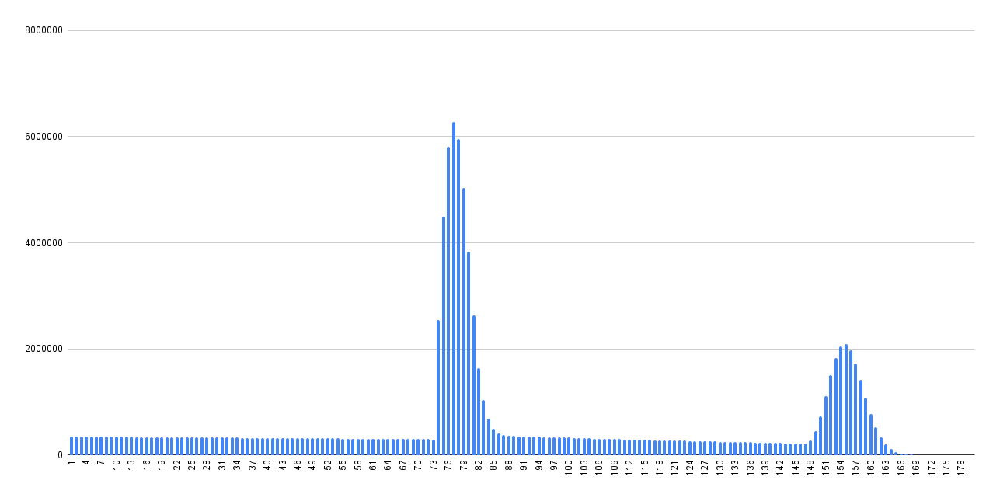

# Honkai Star Rail Pull Simulator
Simulates 100 million accounts pulling until they get a limited 5 star unit.

# Sources for Pull Chances
https://www.reddit.com/r/HonkaiStarRail/comments/1crvz0s/gacha_math_you_have_a_356_chance_of_getting_a_5/

https://starrailstation.com/en/warp#global (50/50 is actually 58/42)

# Results
https://docs.google.com/spreadsheets/d/10vRc8_7Y0zt2OT0ON3uS97ZnuAoym5UB7fHUFmgqeYo/edit?gid=945019410#gid=945019410

## Aggregates

Total Simulations: **100,000,000**

Total Pulls: **8,846,166,043**

Average number of pulls to get a limited unit: **88,46166043**

## Histogram

## Detailed Results

| Pulls | Simulations ended | Percentage | Cumulative Percentage |
|-------|-------------------|------------|-----------------------|
|     1 |            347499 |    0,3475% |               0,3475% |
|     2 |            348076 |    0,3481% |               0,6956% |
|     3 |            346605 |    0,3466% |               1,0422% |
|     4 |            346079 |    0,3461% |               1,3883% |
|     5 |            345346 |    0,3453% |               1,7336% |
|     6 |            344823 |    0,3448% |               2,0784% |
|     7 |            343955 |    0,3440% |               2,4224% |
|     8 |            343451 |    0,3435% |               2,7658% |
|     9 |            343034 |    0,3430% |               3,1089% |
|    10 |            343859 |    0,3439% |               3,4527% |
|    11 |            341490 |    0,3415% |               3,7942% |
|    12 |            341813 |    0,3418% |               4,1360% |
|    13 |            341025 |    0,3410% |               4,4771% |
|    14 |            339849 |    0,3398% |               4,8169% |
|    15 |            338756 |    0,3388% |               5,1557% |
|    16 |            339144 |    0,3391% |               5,4948% |
|    17 |            338599 |    0,3386% |               5,8334% |
|    18 |            338614 |    0,3386% |               6,1720% |
|    19 |            337353 |    0,3374% |               6,5094% |
|    20 |            335524 |    0,3355% |               6,8449% |
|    21 |            334727 |    0,3347% |               7,1796% |
|    22 |            334056 |    0,3341% |               7,5137% |
|    23 |            334137 |    0,3341% |               7,8478% |
|    24 |            333063 |    0,3331% |               8,1809% |
|    25 |            332215 |    0,3322% |               8,5131% |
|    26 |            332474 |    0,3325% |               8,8456% |
|    27 |            331508 |    0,3315% |               9,1771% |
|    28 |            330944 |    0,3309% |               9,5080% |
|    29 |            329773 |    0,3298% |               9,8378% |
|    30 |            329234 |    0,3292% |              10,1670% |
|    31 |            328982 |    0,3290% |              10,4960% |
|    32 |            328578 |    0,3286% |              10,8246% |
|    33 |            326466 |    0,3265% |              11,1511% |
|    34 |            326942 |    0,3269% |              11,4780% |
|    35 |            325417 |    0,3254% |              11,8034% |
|    36 |            325302 |    0,3253% |              12,1287% |
|    37 |            323978 |    0,3240% |              12,4527% |
|    38 |            322517 |    0,3225% |              12,7752% |
|    39 |            322264 |    0,3223% |              13,0975% |
|    40 |            322766 |    0,3228% |              13,4202% |
|    41 |            321613 |    0,3216% |              13,7419% |
|    42 |            320128 |    0,3201% |              14,0620% |
|    43 |            320544 |    0,3205% |              14,3825% |
|    44 |            319455 |    0,3195% |              14,7020% |
|    45 |            318303 |    0,3183% |              15,0203% |
|    46 |            317728 |    0,3177% |              15,3380% |
|    47 |            317573 |    0,3176% |              15,6556% |
|    48 |            315787 |    0,3158% |              15,9714% |
|    49 |            316381 |    0,3164% |              16,2877% |
|    50 |            313613 |    0,3136% |              16,6014% |
|    51 |            314736 |    0,3147% |              16,9161% |
|    52 |            313596 |    0,3136% |              17,2297% |
|    53 |            312457 |    0,3125% |              17,5422% |
|    54 |            311137 |    0,3111% |              17,8533% |
|    55 |            311054 |    0,3111% |              18,1643% |
|    56 |            310095 |    0,3101% |              18,4744% |
|    57 |            309487 |    0,3095% |              18,7839% |
|    58 |            308819 |    0,3088% |              19,0927% |
|    59 |            308464 |    0,3085% |              19,4012% |
|    60 |            307833 |    0,3078% |              19,7090% |
|    61 |            306503 |    0,3065% |              20,0155% |
|    62 |            305092 |    0,3051% |              20,3206% |
|    63 |            304640 |    0,3046% |              20,6253% |
|    64 |            303587 |    0,3036% |              20,9289% |
|    65 |            302886 |    0,3029% |              21,2317% |
|    66 |            301852 |    0,3019% |              21,5336% |
|    67 |            302062 |    0,3021% |              21,8357% |
|    68 |            300826 |    0,3008% |              22,1365% |
|    69 |            299519 |    0,2995% |              22,4360% |
|    70 |            299396 |    0,2994% |              22,7354% |
|    71 |            297559 |    0,2976% |              23,0330% |
|    72 |            297790 |    0,2978% |              23,3308% |
|    73 |            296177 |    0,2962% |              23,6269% |
|    74 |           2540932 |    2,5409% |              26,1679% |
|    75 |           4492681 |    4,4927% |              30,6605% |
|    76 |           5806086 |    5,8061% |              36,4666% |
|    77 |           6283611 |    6,2836% |              42,7502% |
|    78 |           5957367 |    5,9574% |              48,7076% |
|    79 |           5033540 |    5,0335% |              53,7411% |
|    80 |           3824927 |    3,8249% |              57,5661% |
|    81 |           2636681 |    2,6367% |              60,2028% |
|    82 |           1634736 |    1,6347% |              61,8375% |
|    83 |           1041356 |    1,0414% |              62,8788% |
|    84 |            677469 |    0,6775% |              63,5563% |
|    85 |            487517 |    0,4875% |              64,0438% |
|    86 |            403606 |    0,4036% |              64,4474% |
|    87 |            373017 |    0,3730% |              64,8205% |
|    88 |            361364 |    0,3614% |              65,1818% |
|    89 |            357493 |    0,3575% |              65,5393% |
|    90 |            353414 |    0,3534% |              65,8927% |
|    91 |            352219 |    0,3522% |              66,2449% |
|    92 |            347868 |    0,3479% |              66,5928% |
|    93 |            345246 |    0,3452% |              66,9381% |
|    94 |            342374 |    0,3424% |              67,2804% |
|    95 |            339479 |    0,3395% |              67,6199% |
|    96 |            336645 |    0,3366% |              67,9566% |
|    97 |            333783 |    0,3338% |              68,2903% |
|    98 |            331749 |    0,3317% |              68,6221% |
|    99 |            329632 |    0,3296% |              68,9517% |
|   100 |            325733 |    0,3257% |              69,2775% |
|   101 |            323235 |    0,3232% |              69,6007% |
|   102 |            319365 |    0,3194% |              69,9201% |
|   103 |            317141 |    0,3171% |              70,2372% |
|   104 |            313759 |    0,3138% |              70,5510% |
|   105 |            310722 |    0,3107% |              70,8617% |
|   106 |            308872 |    0,3089% |              71,1705% |
|   107 |            305973 |    0,3060% |              71,4765% |
|   108 |            303085 |    0,3031% |              71,7796% |
|   109 |            299895 |    0,2999% |              72,0795% |
|   110 |            298629 |    0,2986% |              72,3781% |
|   111 |            295284 |    0,2953% |              72,6734% |
|   112 |            294008 |    0,2940% |              72,9674% |
|   113 |            290338 |    0,2903% |              73,2578% |
|   114 |            287892 |    0,2879% |              73,5457% |
|   115 |            286029 |    0,2860% |              73,8317% |
|   116 |            283116 |    0,2831% |              74,1148% |
|   117 |            280476 |    0,2805% |              74,3953% |
|   118 |            278095 |    0,2781% |              74,6734% |
|   119 |            275898 |    0,2759% |              74,9493% |
|   120 |            272548 |    0,2725% |              75,2218% |
|   121 |            270381 |    0,2704% |              75,4922% |
|   122 |            268278 |    0,2683% |              75,7605% |
|   123 |            267333 |    0,2673% |              76,0278% |
|   124 |            263789 |    0,2638% |              76,2916% |
|   125 |            262878 |    0,2629% |              76,5545% |
|   126 |            259315 |    0,2593% |              76,8138% |
|   127 |            256732 |    0,2567% |              77,0705% |
|   128 |            255540 |    0,2555% |              77,3261% |
|   129 |            252520 |    0,2525% |              77,5786% |
|   130 |            250126 |    0,2501% |              77,8287% |
|   131 |            247835 |    0,2478% |              78,0765% |
|   132 |            245463 |    0,2455% |              78,3220% |
|   133 |            244125 |    0,2441% |              78,5661% |
|   134 |            241933 |    0,2419% |              78,8081% |
|   135 |            240674 |    0,2407% |              79,0487% |
|   136 |            239025 |    0,2390% |              79,2878% |
|   137 |            235106 |    0,2351% |              79,5229% |
|   138 |            234291 |    0,2343% |              79,7572% |
|   139 |            231669 |    0,2317% |              79,9888% |
|   140 |            228637 |    0,2286% |              80,2175% |
|   141 |            227555 |    0,2276% |              80,4450% |
|   142 |            224780 |    0,2248% |              80,6698% |
|   143 |            222925 |    0,2229% |              80,8927% |
|   144 |            222179 |    0,2222% |              81,1149% |
|   145 |            219474 |    0,2195% |              81,3344% |
|   146 |            217667 |    0,2177% |              81,5520% |
|   147 |            214964 |    0,2150% |              81,7670% |
|   148 |            276689 |    0,2767% |              82,0437% |
|   149 |            444864 |    0,4449% |              82,4886% |
|   150 |            731875 |    0,7319% |              83,2204% |
|   151 |           1107132 |    1,1071% |              84,3276% |
|   152 |           1498254 |    1,4983% |              85,8258% |
|   153 |           1833318 |    1,8333% |              87,6591% |
|   154 |           2045117 |    2,0451% |              89,7043% |
|   155 |           2089150 |    2,0892% |              91,7934% |
|   156 |           1970058 |    1,9701% |              93,7635% |
|   157 |           1726010 |    1,7260% |              95,4895% |
|   158 |           1410256 |    1,4103% |              96,8997% |
|   159 |           1077386 |    1,0774% |              97,9771% |
|   160 |            771781 |    0,7718% |              98,7489% |
|   161 |            519412 |    0,5194% |              99,2683% |
|   162 |            326967 |    0,3270% |              99,5953% |
|   163 |            193998 |    0,1940% |              99,7893% |
|   164 |            107471 |    0,1075% |              99,8967% |
|   165 |             55577 |    0,0556% |              99,9523% |
|   166 |             27119 |    0,0271% |              99,9794% |
|   167 |             12381 |    0,0124% |              99,9918% |
|   168 |              5265 |    0,0053% |              99,9971% |
|   169 |              1960 |    0,0020% |              99,9990% |
|   170 |               650 |    0,0007% |              99,9997% |
|   171 |               228 |    0,0002% |              99,9999% |
|   172 |                61 |    0,0001% |             100,0000% |
|   173 |                13 |    0,0000% |             100,0000% |
|   174 |                 0 |    0,0000% |             100,0000% |
|   175 |                 0 |    0,0000% |             100,0000% |
|   176 |                 0 |    0,0000% |             100,0000% |
|   177 |                 0 |    0,0000% |             100,0000% |
|   178 |                 0 |    0,0000% |             100,0000% |
|   179 |                 0 |    0,0000% |             100,0000% |
|   180 |                 0 |    0,0000% |             100,0000% |